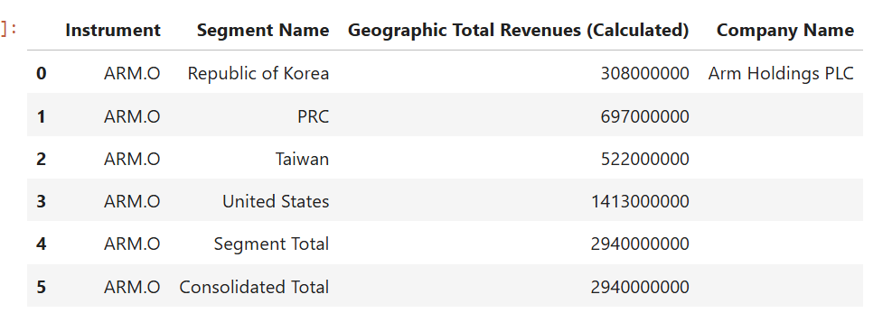
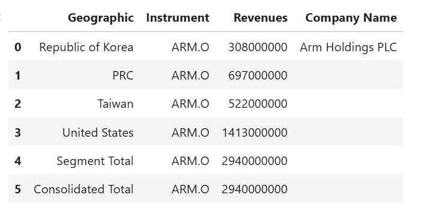
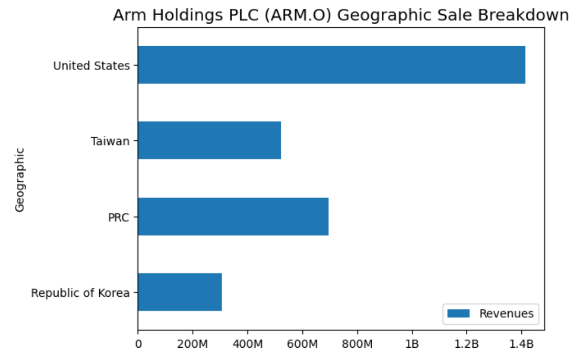

# Fundamentals Company Geographic Sales Breakdown
- Last update: March 2025
- Environment: Windows 
- Compiler: Python 
- Prerequisite: LSEG Workspace desktop application with access to Data Libary.

## <a id="overview"></a>Project Overview

Workspace platform's Fundamentals has over 35 years of experience in collecting and delivering the most timely and highest quality fundamentals data in the industry, including an unmatched depth and breadth of primary financial statements, footnote items, segment data, industry specific operating metrics, financial ratios, and much more. 

The Fundamentals data standardized and As Reported financial statement data – both interim and annual – along with per-share data, calculated financial ratios, company profile information, security data, Officers & Directors and market content for over 90,000 issuers. 

## <a id="geographic"></a>Geographic Breakdown Fundamentals Data

The Fundamentals data also contains information for each segment reported by a company on an annual and interim basis Global coverage. This information lets you drive down your interested company sale revenue of each region.

This project shows how to use [Data Library for Python](https://developers.lseg.com/en/api-catalog/lseg-data-platform/lseg-data-library-for-python) to consume company geographic sale data from Workspace Platform, then breakdown and display each region revenue in readable graph format in the [Jupyter Lab](https://jupyter.org/) application.

## <a id="rdp_lib"></a>Introduction to the Data Library for Python

The [Data Library for Python](https://developers.lseg.com/en/api-catalog/lseg-data-platform/lseg-data-library-for-python) provides a set of ease-of-use interfaces offering coders uniform access to the breadth and depth of financial data and services available on the Workspace, RDP, and Real-Time Platforms. The API is designed to provide consistent access through multiple access channels and target both Professional Developers and Financial Coders. Developers can choose to access content from the desktop, through their deployed streaming services, or directly to the cloud. With the Data Library, the same Python code can be used to retrieve data regardless of which access point you choose to connect to the platform.

 

The Data Library are available in the following programming languages:

- [Python](https://developers.lseg.com/en/api-catalog/lseg-data-platform/lseg-data-library-for-python)
- [.NET](https://developers.lseg.com/en/api-catalog/lseg-data-platform/lseg-data-library-for-net)
- [TypeScript](https://developers.lseg.com/en/api-catalog/refinitiv-data-platform/refinitiv-data-library-for-typescript)

For more deep detail regarding the Data Library for Python, please refer to the following articles and tutorials:

- [Quickstart](https://developers.lseg.com/en/api-catalog/lseg-data-platform/lseg-data-library-for-python/quick-start).
- [Documentation](https://developers.lseg.com/en/api-catalog/lseg-data-platform/lseg-data-library-for-python/documentation).
- [Tutorials](https://developers.lseg.com/en/api-catalog/lseg-data-platform/lseg-data-library-for-python/tutorials).
- [GitHub](https://github.com/LSEG-API-Samples/Example.DataLibrary.Python).

### Disclaimer

This project is based on Data Library Python versions **2.0.1** using the Desktop Session only.

## <a id="prerequisite"></a>Prerequisite
This example requires the following dependencies softwares and libraries.
1. LSEG Workspace desktop application with access to Data Library for Python.
2. [Python](https://www.python.org/) ([Ananconda](https://www.anaconda.com/distribution/) or [MiniConda](https://docs.conda.io/en/latest/miniconda.html) distribution/package manager also compatible).
3. [Jupyter Lab](https://jupyter.org/) application.

*Note:* 
- This Project has been qualified with Python version 3.11.5
- If you are not familiar with Jupyter Notebook, the following [tutorial](https://www.datacamp.com/community/tutorials/tutorial-jupyter-notebook) created by DataCamp may help you.

## <a id="eikon_setup"></a>Data Library with Desktop Session Set Up

Please follow a step by step guide to setup your library and App-Key in "Desktop - Eikon or LSEG Workspace" of [LSEG Data Library for Python Quick Start page](https://developers.lseg.com/en/api-catalog/lseg-data-platform/lseg-data-library-for-python/quick-start) . 

## <a id="running"></a>How to run this example

Please note that the Workspace desktop application integrates a Data API proxy that acts as an interface between the Python library and the Workspace Platform. For this reason, the Workspace application must be running when you use the Data library.

The first step is unzip or download the example project folder into a directory of your choice, then choose how to run application based on your environment below.

### Running the Notebook example.

1. Open a Command Prompt and go to project's folder
2. Run the following command in a Command Prompt to create a Python virtual environment named *global_sale* for the project.

    ```bash
    $>python -m venv global_sale
    ```

3. Once the environment is created, activate a virtual environment named ```global_sale``` with this command in a Command Prompt

    ```bash
    $>global_sale\Scripts\activate
    ```

4. Go to project's notebook folder and update a contain in ```lseg-data.config.json``` file with the your App-Key

    ```json
    {
        "logs": {
            "level": "debug",
            "transports": {
                "console": {
                    "enabled": false
                },
                "file": {
                    "enabled": false,
                    "name": "lseg-data-lib.log"
                }
            }
        },
        "sessions": {
            "default": "desktop.workspace",
            "desktop": {
                "workspace": {
                    "app-key": "YOUR APP KEY GOES HERE!"
                }
            }
        }
    }
    ```

5. In the current Command Prompt, go to project's notebook folder. Run the following command to start Jupyter Lab in the notebook folder.

    ```bash
    $>(global_sale)>notebook>jupyter lab
    ```

6. Open *fundamentals_ld.ipynb* Notebook document, then follow through each notebook cell.

     

## <a id="implementation"></a>Implementation

There are three main steps for this implementation
1. Get Company Geographic Sale Data.
2. Restructure Company Geographic Sale Data Dataframe object that returned from Data Library.
3. Plotting a graph.

### Get Company Geographic Sale Data
o
Firstly, the Notebook application uses Data Library ```get_data``` method to request the company fundamentals via following  fields:
- TR.BGS.GeoTotalRevenue.segmentName: Segment (Geographic) data
- TR.BGS.GeoTotalRevenue: Each segment revenue value
- TR.CompanyName

I am demonstrating with [Arm Holdings](https://www.arm.com/) (RIC Code: **ARM.O**) as an example data set.

```python
df = ld.get_data(universe = ric, 
                 fields=['TR.BGS.GeoTotalRevenue.segmentName', 'TR.BGS.GeoTotalRevenue','TR.CompanyName'])
df
```

 

This ```get_data``` function returns data as [Pandas Dataframe object](https://pandas.pydata.org/pandas-docs/stable/reference/api/pandas.DataFrame.html) by default. 

### Restructure Company Geographic Sale Data Dataframe object.

The returned Dataframe object from Data Library ```get_data``` function is not ready to be plotted as "readable" graph yet. 

Then, I rename the *Segment Name* and *Geographic Total Revenues (Calculated)* columns to readable names like *Geographic* and *Revenues*.

```python
df_graph = df.copy()

df_graph.rename(columns={
                   'Segment Name':'Geographic',
                   'Geographic Total Revenues (Calculated)':'Revenues'},
         inplace = True)

df_graph
```

 

Then we get the Company name and Consolidated Total Revenue information from Dataframe object.

```python
total_sale = df_graph.iloc[df_graph.shape[0] - 1]['Revenues']

company_name = df_graph.iloc[0]['Company Name']
```

And the last thing on this phase is to remove the Total revenue rows from the Dataframe as we will display a Consolidated Total information at a graph footter.

```python
df_graph = df_graph[df_graph['Geographic'] != 'Segment Total']
df_graph = df_graph[df_graph['Geographic'] != 'Consolidated Total']
```

### Plotting a graph

Finally, we are now ready for plotting a graph. We create a Python function ```format_revenues_number``` to reformat large revenue numbers into a readable numbers in trillions, billions or millions unit. a readable numbers in trillions, billions or millions unit. This function source code is based on [Dan Friedman](https://github.com/frieds/frieds.github.io)'s [How to Format Large Tick Values tutorial](https://github.com/frieds/frieds.github.io/tree/master/data-visualizations/how_to_format_large_tick_values_files) source code via GitHub.

```python
def format_revenues_number(tick_val, pos):
    """
    Turns large tick values (in the trillions, billions, millions and thousands) such as 4500 into 4.5K 
    and also appropriately turns 4000 into 4K (no zero after the decimal).
    """
    if tick_val >= 1000000000000: # Add support for trillions
        val = round(tick_val/1000000000000, 1)
        new_tick_format = '{:}T'.format(val)
    elif tick_val >= 1000000000:
        val = round(tick_val/1000000000, 1)
        new_tick_format = '{:}B'.format(val)
    elif tick_val >= 1000000:
        val = round(tick_val/1000000, 1)
        new_tick_format = '{:}M'.format(val)
    elif tick_val >= 1000:
        val = round(tick_val/1000, 1)
        new_tick_format = '{:}K'.format(val)
    elif tick_val < 1000:
        new_tick_format = round(tick_val, 1)
    else:
        new_tick_format = tick_val

     # make new_tick_format into a string value
    new_tick_format = str(new_tick_format)
    """
    code below will keep 4.5M as is but change values such as 4.0M to 4M since that 
    zero after the decimal isn't needed
    """
    index_of_decimal = new_tick_format.find(".")
    
    if index_of_decimal != -1:
        value_after_decimal = new_tick_format[index_of_decimal+1]
        if value_after_decimal == "0":
            # remove the 0 after the decimal point since it's not needed
            new_tick_format = new_tick_format[0:index_of_decimal] + new_tick_format[index_of_decimal+2:]
            
    return new_tick_format
```

We use Python [matplotlib.pyplot](https://matplotlib.org/api/pyplot_api.html) library to plot a bar graph that represent each region revenue from restructured Dataframe object in Jupyter Notebook.


```python
# Plotting a Graph

df_graph.set_index('Geographic',drop=True,inplace=True)
fig = plt.figure()

#Format Total Sale display unit as a graph footer.
fig.text(.5, -.05, 'Consolidated Total Sale %s' %(f'{total_sale:,.2f}'), ha='center',fontsize='large')

# Create graph title from Company and RIC names dynamically.
plt.ticklabel_format(style = 'plain')
plt.title('%s (%s) Geographic Sale Breakdown' % (company_name, 'IBM.N'), color='black',fontsize='x-large')
ax = fig.gca()

#Apply Sale data into millions function.
formatter = FuncFormatter(format_revenues_number)
ax.xaxis.set_major_formatter(formatter)

df_graph.plot(kind='barh', ax = fig.gca())
plt.show()
```

 

## <a id="summary"></a>Conclusion

Workspace platform provides a wide range of Fundamentals data for your investment decisions including company geographic sale information. This information helps you analysis the revenue from each geographic region of your interested company in both panel data and graph formats.

## <a id="references"></a>References

You can find more detail regarding the Data Library and related technologies for this Notebook from the following resources:

- [LSEG Data Library for Python](https://developers.lseg.com/en/api-catalog/lseg-data-platform/lseg-data-library-for-python) on the [LSEG Developer Community](https://developers.lseg.com/)
- [Data Library for Python - Reference Guide](https://developers.lseg.com/en/api-catalog/lseg-data-platform/lseg-data-library-for-python/documentation#reference-guide)
- [The Data Library for Python  - Quick Reference Guide (Access layer)](https://developers.lseg.com/en/article-catalog/article/the-data-library-for-python-quick-reference-guide-access-layer) article.
- [Essential Guide to the Data Libraries - Generations of Python library (EDAPI, RDP, RD, LD)](https://developers.lseg.com/en/article-catalog/article/essential-guide-to-the-data-libraries) article.
- [Upgrade from using Eikon Data API to the Data library](https://developers.lseg.com/en/article-catalog/article/Upgrade-from-using-Eikon-Data-API-to-the-Data-library) article.
- [Data Library for Python Examples on GitHub](https://github.com/LSEG-API-Samples/Example.DataLibrary.Python) repository.
- [Dan Friedman's Python programming, data analysis, data visualizations tutorials](https://github.com/frieds/frieds.github.io).
- [Pandas API Reference](https://pandas.pydata.org/docs/reference/index.html).
- [Pyplot Graph API Reference](https://matplotlib.org/api/pyplot_api.html).

For any question related to this example or Data Library, please use the Developers Community [Q&A Forum](https://community.developers.refinitiv.com).